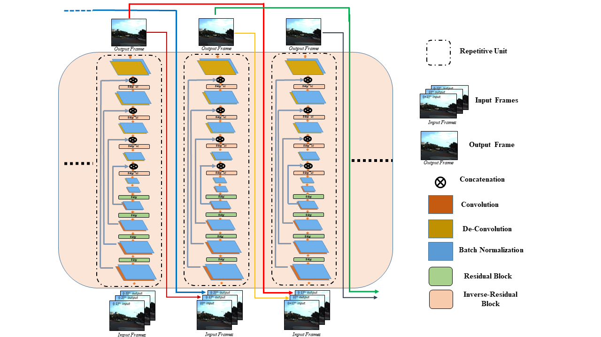
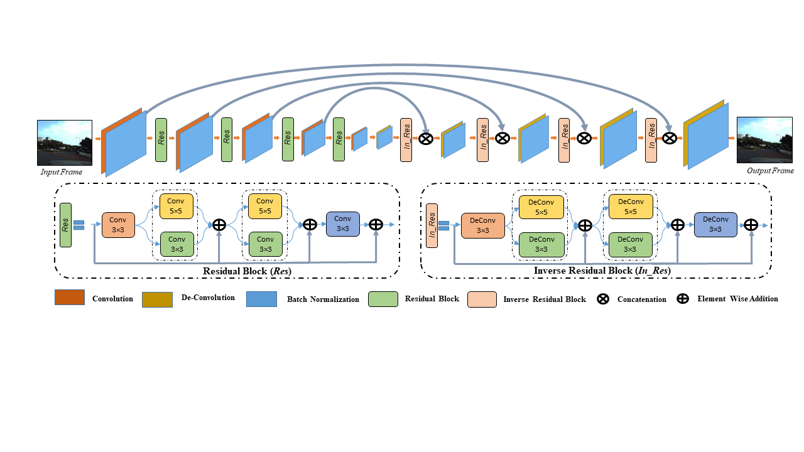
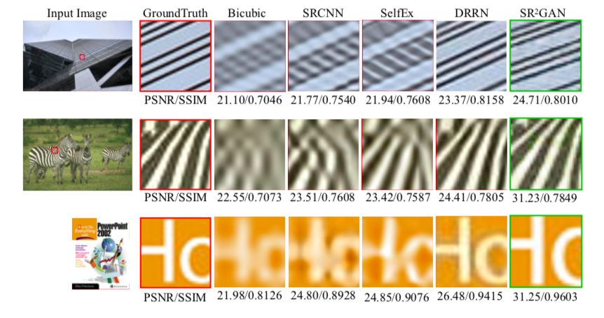

# SR2GAN
Video results for the original videos such as city,calendar,foliage and walk from the Derf’s collection [4], provided as supplementary material to:

Omkar Thawakar, Prashant W Patil, Subrahmanyam Murala and U.V. Kulkarni, **"Image and Video Super Resolution with Recurrent Generative Adversarial Network,"** submitted, May 2019.

## Description
This repository contains qualitative comparison of video super-resolution SR2GAN with VSR_DUF [1] for four different videos (city,foliage,car,calendar) from Derf's collection [4]. It also contains some examples of image super-resolution results with some of state-of-the-art methods such as SRCNN [2], DRRN [3] , etc. All video file are located in the results/video folder. Image super-resolution results contains comparison with images from set14 [5], BSD100 [6] and Urban100 [7] dataset in terms of PSNR(Peak signal to noise ratio) and SSIM(structural self-similarity index).

## Video Super-Resolution SR2GAN Network 

## Image Super-Resolution SR2GAN Network

## Video Super-Resolution Results
City

Calendar

Foliage

Walk

## Image Super-Resolution Results

## CVPR 2019 Image/Video Super-Resolution Workshop results

Following results are obtained with dataset given by NTIRE CVPR 2019 Image/Video SR challenge.

  
  
  

  
  
  

  
  
  

  
  
  

  
  
  

## References
1. Younghyun Jo, Seoung Wug Oh, Jaeyeon Kang,Seon Joo Kim, “Deep Video Super-Resolution Network UsingDynamic Upsampling Filters Without Explicit Motion Compensation " In CVPR 2018.
2. C.Dong,C.Loy,K.He,andX.Tang.Imagesuper-resolution using deep convolutional networks. IEEE Transactions on Pattern Analysis and Machine Intelligence, 38(2):295–307, 2016.
3. Ying Tai, Jian Yang, and Xiaoming Liu, “Image Super-Resolution via Deep Recursive Residual Network ” In CVPR 2017.
4. https://media.xiph.org/video/derf/
5. R. Zeyde, M. Elad, and M. Protter. On single image scale- up using sparse-representations. Curves and Surfaces, pages 711–730, 2012.
6. D. Martin, C. Fowlkes, D. Tal, and J. Malik. A database of human segmented natural images and its application to evaluating segmentation algorithms and measuring ecologi- cal statistics. In ICCV, 2001.
7. J.-B. Huang, A. Singh, and N. Ahuja. Single image super- resolution from transformed self-exemplars. In CVPR, 2015.

